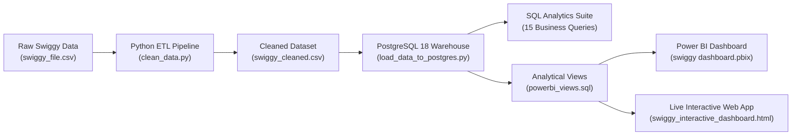

# 🍽️ Swiggy Restaurant Analytics & Intelligence Dashboard

[](https://www.postgresql.org/)
[](https://powerbi.microsoft.com/)
[](https://www.python.org/)
[](https://pandas.pydata.org/)
[](LICENSE)

An end-to-end Data Analytics project uncovering customer dining preferences, pricing economics, cuisine market share, and promotional sensitivity across **139,321 restaurants** spanning **580+ Indian cities**.

---

## 📌 Executive Summary & Key KPIs

| Metric | Database Result | Business Significance |
| :--- | :--- | :--- |
| **Total Analyzed Outlets** | **139,321** | Comprehensive multi-city inventory footprint |
| **Average Cost for Two** | **₹268.91** | Mass-market affordability (Median: ₹200) |
| **Platform Average Rating** | **4.04 ⭐** | High consumer quality benchmark |
| **Total Reviews Captured** | **58.01 Million** | Deep customer sentiment & engagement volume |
| **Pure Veg Market Share** | **42.0% (58,495 Outlets)** | Concentrated in Western & Central India |

---

## 🏗️ Project Architecture & Data Pipeline



1. **ETL & Data Cleaning ([`clean_data.py`](clean_data.py))**:
   - Text sanitization, numeric rating conversion (e.g. `'1K+ ratings'` ➔ `1000.0`).
   - Deduplication, missing value imputation, and feature engineering (`cuisine_count`, `primary_cuisine`, `rating_status`).
2. **Database Ingestion ([`load_data_to_postgres.py`](load_data_to_postgres.py))**:
   - Ingests 139,321 records into PostgreSQL table `swiggy_restaurants` in **1.87 seconds** using bulk `COPY`.
   - Generates B-tree indexes on `location`, `primary_cuisine`, `rating`, `cost_for_two`, and `is_pure_veg`.
3. **Business SQL Analytics ([`swiggy_business_queries.sql`](swiggy_business_queries.sql))**:
   - 15 production-grade SQL queries using Window Functions, CTEs, Filter Aggregations, and BCG Matrix classification.
4. **Power BI Dashboard ([`swiggy dashboard.pbix`](swiggy%20dashboard.pbix))**:
   - Styled with the official custom **Swiggy Deep Navy & Vibrant Orange theme** ([`swiggy_powerbi_theme.json`](powerbi/swiggy_powerbi_theme.json)).

---

## 💡 Top Strategic Business Insights

### 1. 🎯 The Pricing Sweet Spot (`₹401 – ₹700`)
* **Finding**: While budget meals ($< ₹200$) dominate platform volume (64,091 listings), outlets in the **₹401–₹700** tier achieve the highest customer satisfaction (**4.16 ⭐**) and nearly **double the review volume (948 reviews vs 481)**.
* **Recommendation**: Swiggy should aggressively merchandise upper mid-range combos to maximize gross merchandise value (GMV) and customer retention.

### 2. 🍲 Specialist vs. Generalist Menus
* **Finding**: Single-cuisine kitchens score higher ratings (**4.09 ⭐ vs 4.02 ⭐**) and generate **13.2% more customer reviews (592 vs 523)** than generalist multi-cuisine restaurants (5+ cuisines).
* **Recommendation**: Partner onboarding should discourage menu bloat and incentivize focused, signature cuisine menus.

### 3. 🏷️ The Promotional Lift (+45.6% Review Surge)
* **Finding**: Outlets running **3 or more active offers** capture **581 reviews** on average compared to **399 reviews** for non-discounted listings (**a 45.6% increase**), without suffering any rating penalty (4.04 ⭐ vs 4.01 ⭐).

### 4. 🥗 The Pure-Veg Whitespace
* **Finding**: Vegetarian preferences are geographically polarized: **Ahmedabad (77.0%)**, **Indore (74.0%)**, and **Surat (73.7%)** are overwhelmingly vegetarian, whereas Kolkata (18%) and Goa (18%) represent meat-dominant markets.
* **Recommendation**: Dedicated pure-veg cloud kitchen investments should be hyper-targeted to Gujarat and Madhya Pradesh.

### 5. ⚠️ Cold-Start Deficit in Tier-2 Hubs
* **Finding**: Over **52.2% of restaurants in Jaipur** and **46.0% in Agra** have zero reviews or ratings.
* **Recommendation**: Deploy automated "First-Order Review" coupons (e.g., ₹50 cashback for the first 5 customer ratings) in these cold-start markets.

---

## 📊 SQL Business Intelligence Suite (Sample Queries)

The suite ([`swiggy_business_queries.sql`](swiggy_business_queries.sql)) answers 15 core executive questions:

```sql
-- Sample: Restaurant Strategic Positioning Matrix (BCG Value vs Premium Quadrants)
WITH Metrics AS (
    SELECT 
        AVG(rating) AS overall_avg_rating,
        AVG(cost_for_two) AS overall_avg_cost
    FROM swiggy_restaurants
    WHERE rating IS NOT NULL
)
SELECT 
    CASE 
        WHEN r.rating >= m.overall_avg_rating AND r.cost_for_two < m.overall_avg_cost 
            THEN '1. Value Champions (High Rating, Low Price)'
        WHEN r.rating >= m.overall_avg_rating AND r.cost_for_two >= m.overall_avg_cost 
            THEN '2. Premium Leaders (High Rating, High Price)'
        WHEN r.rating < m.overall_avg_rating AND r.cost_for_two < m.overall_avg_cost 
            THEN '3. Budget Underperformers (Low Rating, Low Price)'
        ELSE '4. Overpriced Risk (Low Rating, High Price)'
    END AS strategic_quadrant,
    COUNT(*) AS restaurant_count,
    ROUND((COUNT(*) * 100.0 / (SELECT COUNT(*) FROM swiggy_restaurants WHERE rating IS NOT NULL))::numeric, 1) AS pct_of_rated,
    ROUND(AVG(r.rating)::numeric, 2) AS avg_rating,
    ROUND(AVG(r.cost_for_two)::numeric, 0) AS avg_cost_for_two,
    ROUND(AVG(r.rating_count)::numeric, 0) AS avg_ratings_volume
FROM swiggy_restaurants r
CROSS JOIN Metrics m
WHERE r.rating IS NOT NULL
GROUP BY 1
ORDER BY 1;
```

---

## 📈 Power BI Interactive Dashboard

The dashboard file **[`swiggy dashboard.pbix`](swiggy%20dashboard.pbix)** includes:
* **Brand Aesthetics**: Deep Navy (`#070B19`) canvas, Dark Navy glassmorphic cards (`#0D152A`), Swiggy Orange accents (`#FC8019`).
* **KPI Header Cards**: Total Outlets, Average Cost, Customer Rating, Review Volume with SVG trend sparklines.
* **Interactive Slicers**: Multi-select City search, Dietary Category buttons (`Pure Veg` / `Non-Veg / Mixed`), and Price Band filtering.
* **Top National Chains Leaderboard**: Footprint and satisfaction tracking for Domino's, KFC, Pizza Hut, The Belgian Waffle Co., Kwality Walls, etc.

> 🌐 **Live Web Prototype**: You can open [`powerbi/swiggy_interactive_dashboard.html`](powerbi/swiggy_interactive_dashboard.html) directly in any web browser to interact with the responsive dashboard prototype!

---

## 📂 Repository Structure

```text
├── .env.example                          # Database connection environment template
├── .gitignore                            # Git exclusion rules for secrets and caches
├── clean_data.py                         # Data cleaning & feature engineering pipeline
├── load_data_to_postgres.py              # High-speed PostgreSQL bulk ingestion script
├── test_db_connection.py                 # PostgreSQL connection validation script
├── swiggy_business_queries.sql           # 15 Advanced Business SQL queries
├── swiggy dashboard.pbix                 # Microsoft Power BI Interactive Dashboard
├── swiggy_cleaned.csv                    # Final cleaned dataset (139,321 rows)
├── powerbi/
│   ├── powerbi_dashboard_guide.md       # Step-by-step Power BI visual blueprint
│   ├── powerbi_views.sql                # Analytical database views for Power BI
│   ├── swiggy_dax_measures.dax          # 15+ Production DAX formulas
│   ├── swiggy_interactive_dashboard.html# Live standalone interactive web dashboard
│   └── swiggy_powerbi_theme.json        # Official Swiggy brand theme for Power BI
└── README.md                             # Project documentation & business insights
```

---

## 🚀 Setup & Execution Guide

### 1. Prerequisites
* Python 3.10+
* PostgreSQL 14+ (Installed & running locally)
* Microsoft Power BI Desktop (for viewing/editing `.pbix`)

### 2. Installation
```bash
# Clone the repository
git clone https://github.com/Aryansoam19/SWIGGY-RESTAURANT-ANALYTICS.git
cd SWIGGY-RESTAURANT-ANALYTICS

# Install required Python libraries
pip install pandas numpy psycopg2-binary
```

### 3. Database Configuration
Copy `.env.example` to `.env` and fill in your PostgreSQL credentials:
```ini
PGHOST=localhost
PGPORT=5432
PGDATABASE=postgres
PGUSER=postgres
PGPASSWORD=your_password_here
```

### 4. Run Data Ingestion
```bash
# Verify connection
python test_db_connection.py

# Ingest cleaned data into PostgreSQL
python load_data_to_postgres.py
```

### 5. Launch Power BI Dashboard
1. Open [`swiggy dashboard.pbix`](swiggy%20dashboard.pbix) in **Power BI Desktop**.
2. Refresh data from your local PostgreSQL server or explore the pre-packaged dataset.

---

## 👤 Author
**Aryan Soam**  
* GitHub: [@Aryansoam19](https://github.com/Aryansoam19)  
* Project: [SWIGGY-RESTAURANT-ANALYTICS](https://github.com/Aryansoam19/SWIGGY-RESTAURANT-ANALYTICS)
