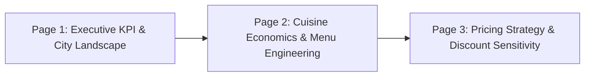

# 📊 Swiggy Interactive Dashboard: Power BI Implementation Guide

This guide details how to build the **Swiggy-themed Power BI Interactive Dashboard** using the PostgreSQL connection, theme file, and DAX measures provided in this project.

---

## 🎨 Step 1: Apply the Swiggy Brand Theme
1. Open **Microsoft Power BI Desktop**.
2. Go to the ribbon: **View** > **Themes** (dropdown) > **Browse for themes...**
3. Select [`swiggy_powerbi_theme.json`](file:///e:/DATA-ANALYTICS/Swiggy%20project%20DA/powerbi/swiggy_powerbi_theme.json).
4. The canvas, cards, charts, and slicers will instantly adapt to **Swiggy Orange (`#FC8019`)** and sleek dark card containers.

---

## 🔌 Step 2: Connect Power BI to PostgreSQL
1. In Power BI Desktop, click **Get Data** > **PostgreSQL database** > **Connect**.
2. Enter connection details:
   - **Server**: `localhost:5432`
   - **Database**: `postgres`
   - **Data Connectivity mode**: **Import** (Recommended for smooth slicing) or **DirectQuery**
3. Authentication:
   - **User name**: `postgres`
   - **Password**: `aryansoam19`
4. In the Navigator dialog, check:
   - ✅ `vw_powerbi_restaurants` (Primary Fact Table)
   - ✅ `vw_powerbi_city_summary` (Aggregated City Map table)
   - ✅ `vw_powerbi_cuisine_matrix` (Cuisine Performance Matrix)
5. Click **Load**.

---

## 📐 Step 3: 3-Page Dashboard Blueprint

---

### 📄 Page 1: Executive KPI & City Landscape

#### Top Header & Slicers Bar:
* **Header Title Text Box**: Insert measure `[Dynamic City Title]` or `"Swiggy Restaurant Analytics Overview"`.
* **Slicer 1 (Dropdown)**: `city` (Search enabled).
* **Slicer 2 (Tile / Buttons)**: `veg_category` (`Pure Veg` vs `Non-Veg / Mixed`).
* **Slicer 3 (Dropdown)**: `price_tier`.

#### Row 1: 5 Core KPI Cards:
| Card | Metric Measure | Color |
| :--- | :--- | :--- |
| **Card 1** | `[Total Restaurants]` (139,321) | Orange (`#FC8019`) |
| **Card 2** | `[Average Cost KPI]` (₹269) | White (`#FFFFFF`) |
| **Card 3** | `[Average Rating KPI]` (4.04 ⭐) | Gold (`#FFA700`) |
| **Card 4** | `[Pure Veg Share %]` (42.0%) | Green (`#48C479`) |
| **Card 5** | `[Total Reviews Formatted]` (50M+) | Blue (`#00B4D8`) |

#### Row 2: Visual Charts:
1. **Top 10 Cities by Restaurant Count** *(Clustered Bar Chart)*:
   - **Y-Axis**: `city`
   - **X-Axis**: `Total Restaurants`
   - **Data Labels**: On (White)
2. **Veg vs Non-Veg Market Split** *(Donut Chart)*:
   - **Legend**: `veg_category`
   - **Values**: `Total Restaurants`
   - **Slice Colors**: Pure Veg = `#48C479` (Green), Non-Veg = `#E23744` (Red)
3. **City-Level Ticket Size vs Average Rating** *(Scatter Chart)*:
   - **Values**: `city`
   - **X-Axis**: `Average Cost for Two`
   - **Y-Axis**: `Average Rating`
   - **Size**: `Total Review Volume`

---

### 📄 Page 2: Cuisine Economics & Menu Engineering

#### Visuals:
1. **Top 10 Primary Cuisines Market Share** *(Treemap or Horizontal Bar Chart)*:
   - **Category**: `primary_cuisine`
   - **Values**: `Total Restaurants`
2. **Specialist vs Generalist Kitchen Performance** *(Clustered Column Chart)*:
   - **X-Axis**: `kitchen_model` (`Single Cuisine Specialist`, `Multi-Cuisine (2-4)`, `Generalist`)
   - **Y-Axis**: `Average Rating` & `Total Review Volume`
   - *Key finding highlighted*: Specialist kitchens achieve higher ratings and 13% more reviews!
3. **Cuisine Economics Matrix Table** *(Matrix Visual)*:
   - **Rows**: `primary_cuisine`
   - **Values**:
     - `Total Restaurants`
     - `Average Cost for Two` (Currency formatted)
     - `Average Rating`
     - `Promo Penetration %`
   - **Conditional Formatting**: Add data bars on `Total Restaurants` and background gradient on `Average Rating`.

---

### 📄 Page 3: Pricing Strategy & Promotional Sensitivity

#### Visuals:
1. **The Promotional Lift (Does Discounting Drive Reviews?)** *(Column & Line Combo Chart)*:
   - **Shared X-Axis**: `promotional_tier` (`No Offers`, `1-2 Offers`, `3+ Offers`)
   - **Column Y-Axis**: `[Average Reviews]`
   - **Line Y-Axis**: `[Average Rating]`
   - *Visualizes the +45.6% review surge for aggressive discounters.*
2. **Price Tier Breakdown vs Rating Sweet Spot** *(Clustered Column Chart)*:
   - **X-Axis**: `price_tier`
   - **Y-Axis**: `Average Rating` & `Total Review Volume`
   - *Demonstrates the ₹400–₹700 sweet spot.*
3. **Top 10 National Brand Chains** *(Table Visual)*:
   - **Columns**:
     - `restaurant_name` (Domino's, KFC, Kwality Walls, Belgian Waffle, etc.)
     - `Cities Present`
     - `Average Rating`
     - `Average Cost for Two`
     - `Total Review Volume`
